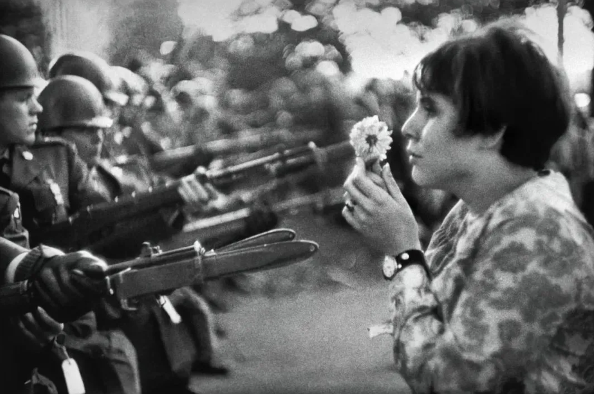

> 献给那些在这次巴以冲突中失去生命的普通民众，那些在俄乌战争中失去父亲、儿子、丈夫的普通民众，还有未来的我们和海岸对面的他们。

---

早上醒来，以色列宣布进入战争状态。

其实，我并不是特别了解中东的历史。对于中东，我的印象还一直停留在这是一片具有神秘色彩的区域，神秘中带着冲突和战火的标签，伴随着危险。最近，一直都在追 「朱志文环球骑行」中的「阿富汗」篇章。在他的镜头中，除了清一色的男性群体，极少见女性群体外，还有他手持各种武器的画面。他也凭借着这些视频片段和真实的性格，在几天时间内粉丝增长破十万。我想，大家除了喜欢这位博主外，还对他视频中出现的武器、阿富汗和塔利班感兴趣，观看他的视频也是一种追寻刺激与满足好奇。

早上，引起我注意的一则新闻是一名叫 Shani Louk 参加和平音乐节的女子赤裸上身被哈马斯组织杀害，并绑在皮卡后座游街，遭受到周围群众的口水侮辱。短短几秒钟的视频，给我带来很强的不适。我无法理解，为什么民众会对一个和自己毫不相关的人去侮辱她的尸体，为什么会如此的亢奋。这其中，即使有再多文化上的冲突，亦或是宗教、国家上的冲突，对于一个普通的民众而言也不至于去唾弃一位毫无关联的死去的人。

我不了解中东历史，这篇文章，我也不想探讨到底是谁对谁错，就像一年前爆发的俄乌战争，各自都有各自的立场和理由。只是，我作为一位生活在 2023 年的普通中国大陆人看来，我只是非常失落。这种失落，不是为 Shani Louk 的离世而感到失落，也不是为巴以冲突的出现而失落。我失落的点，在于时至今日，历史的悲剧总是在不断的重演，人类作为一个微不足道的碳基生物，丝毫不吸取经验教训，未来历史的悲剧还将继续重演，诺兰「奥本海默」上映仿佛已经间隔万年；我失落的点，在于文化本应该是把地球上所有人都紧密的联系在一起，即使我们有着不同的宗教信仰，有着不同的生活背景，但对于基本的人文文化———向善的美，则是相通的。文化，现如今却在割裂我们，将同一种族的人分割开，甚至演变为大家相互仇视。

诚然，不同的文化会有不同的价值观，不同的文化会有不同的行为模式和处世之道。但即使世界上不同文化间差异再多，不同文化的核心底层应该永远都是由人类最基本的真善美构成。基于真善美的核心，不同文化背景的人都会去尊重和包容他人的文化，形成地球村。地球村，这个词太复古了。我最早接触到这个词还在 2008 年，那时候的我还在念小学。在我的印象中，那是一个美好的年代，因为 2008 年北京奥运会我才在脑海中刻下了「地球村」、「奥运村」、「世界村」的概念。

2019年6月，我去香港听陈升的演唱会。陈升，是一位我非常喜欢的台湾音乐制作人，他因为一些政治原因被大陆给封杀了。那年6月香港正巧大规模举行游行运动，去往九龙会展中心的路上，我和朋友问计程车司机，那些人在干嘛。司机听到我们用普通话口音，说，不满啦，你们来的还算是时候，前几天队伍很长的，车子都开不了，路都封掉哩。司机停留片刻，又说，不过，也就是在香港，澳门都不可能有这种事情的啦。

我已经记不得那天演唱会，六十多岁的台湾艺人陈升具体唱歌的画面。我只记得，那场演唱会，他的话很少，在那个阶段，千言万语都不能说，只有拼命的唱歌。演唱会结束前，他说他下一场演唱会在马来西亚。我不知道，他在马来那一场，他的话会不会多起来。

战火不仅仅会摧毁我们的家园，还会摧毁我们的文化。共识一旦被打破，重新建立起来需要付出比之前更多的努力。我始终希望地球村的概念能一直传承下去，但我也知道在权力和欲望面前，所有文化都不值得一提，这也是悲剧的缘由。过往经济发展的这些年，我们只对利益才抱有回应，用金钱来粉饰自己的灵魂，对于已经发生、正在发生，或是将要发生的悲剧，我们都保持沉默，用荒诞的文字编制一则则新闻，机械般注释我们贫瘠的历史。

写到这里，已经没有什么想多说的了。想到，陈升先生的「不再让你孤单」：

> 让我轻轻的吻着你的脸
> 
> 擦乾你伤心的眼泪
> 
> 让你知道在孤单的时候
> 
> 还有一个我 陪着你
> 
> 让我轻轻的对着你歌唱
> 
> 像是吹在草原上的风
> 
> 只想静静听你呼吸
> 
> 紧紧拥抱你 到天明
> 
> 路遥远 我们一起走

从书房走向阳台，打开窗，窗户外漆黑一片。现在是凌晨，不知道，你那边现在是几点。我们同住一片天空下，只是有着不同的时区，却要在赠予我们生命的地球上演各种爱恨情仇。深秋夜晚，风已经凉嗖嗖的，就让我这篇文章被风吹散在空中，抹平曾经的一切和未来的所有。

[本文谢绝一切转载，谢谢]

Lesenelir

